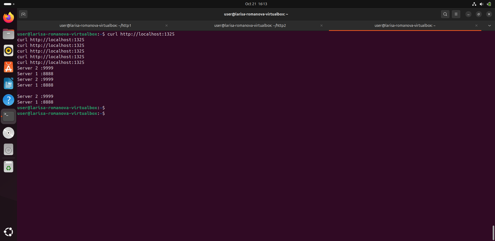
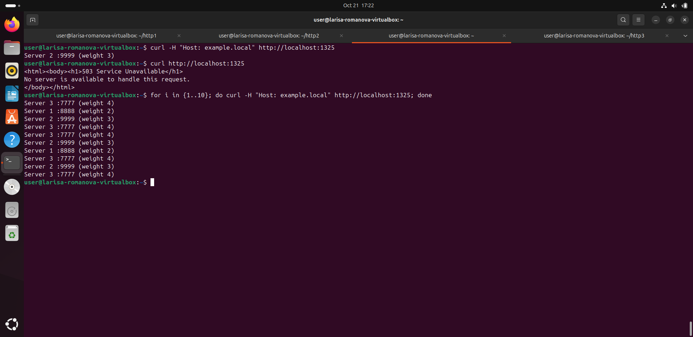

# Задание «Кластеризация и балансировка нагрузки»


## Задание 1

### Запуск серверов и настройка HAProxy

#### Цель задания
Запустите два simple python сервера на своей виртуальной машине на разных портах. Установите и настройте HAProxy. Настройте балансировку Round-robin на 4 уровне.
На проверку направьте конфигурационный файл haproxy, скриншоты, где видно перенаправление запросов на разные серверы при обращении к HAProxy.

#### 1. Запуск двух Python серверов
```bash
# Сервер 1 на порту 8888
cd ~/http1
python3 -m http.server 8888

# Сервер 2 на порту 9999  
cd ~/http2
python3 -m http.server 9999
```
#### 2. Конфигурационный файл haproxy
```bash 
global
    log /dev/log    local0
    log /dev/log    local1 notice
    chroot /var/lib/haproxy
    stats socket /run/haproxy/admin.sock mode 660 level admin expose-fd listeners
    stats timeout 30s
    user haproxy
    group haproxy
    daemon

defaults
    log     global
    mode    tcp
    option  tcplog
    option  dontlognull
    timeout connect 5000
    timeout client  50000
    timeout server  50000

# Статистика
listen stats
    bind    :888
    mode    http
    stats   enable
    stats   uri /stats
    stats   refresh 5s
    stats   realm Haproxy\ Statistics

# Балансировка на 4 уровне (TCP)
listen web_tcp
    mode    tcp
    bind    :1325
    balance roundrobin
    server  s1 127.0.0.1:8888 check
    server  s2 127.0.0.1:9999 check
```
#### 3. Скриншот работы балансировки Round-robin


## Задание 2

### Настройка Weighted Round Robin на 7 уровне

#### Цель задания
Запустите три simple python сервера на своей виртуальной машине на разных портах. Настройте балансировку Weighted Round Robin на 7 уровне, чтобы первый сервер имел вес 2, второй - 3, а третий - 4. HAProxy должен балансировать только тот http-трафик, который адресован домену example.local.

#### 1. Запуск трех Python серверов
```bash
# Сервер 1 на порту 8888 (вес 2)
cd ~/http1
echo "Server 1 :8888 (weight 2)" > index.html
python3 -m http.server 8888

# Сервер 2 на порту 9999 (вес 3)  
cd ~/http2
echo "Server 2 :9999 (weight 3)" > index.html
python3 -m http.server 9999

# Сервер 3 на порту 7777 (вес 4)
cd ~/http3  
echo "Server 3 :7777 (weight 4)" > index.html
python3 -m http.server 7777
```
#### 2. Конфигурационный файл haproxy
```bash 
global
    log /dev/log    local0
    log /dev/log    local1 notice
    chroot /var/lib/haproxy
    stats socket /run/haproxy/admin.sock mode 660 level admin expose-fd listeners
    stats timeout 30s
    user haproxy
    group haproxy
    daemon

defaults
    log     global
    mode    http
    option  httplog
    option  dontlognull
    timeout connect 5000
    timeout client  50000
    timeout server  50000

# Frontend - только для example.local на порту 1325
frontend main
    mode http
    bind :1325
    acl example_domain hdr(host) -i example.local
    use_backend app_servers if example_domain

# Backend с весами 2, 3, 4
backend app_servers
    mode http
    balance roundrobin
    server s1 127.0.0.1:8888 weight 2
    server s2 127.0.0.1:9999 weight 3
    server s3 127.0.0.1:7777 weight 4
```
#### 3. Скриншот работы балансировки


